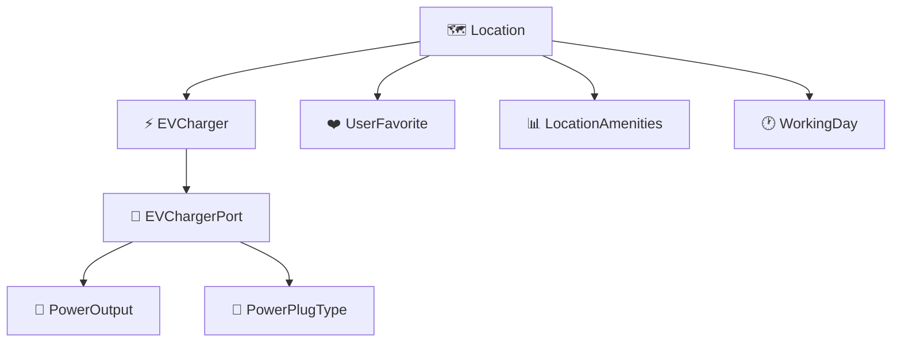

# ⚡ EV Charger Management System

<div align="center">


**🚗 Powering the Future of Electric Vehicle Charging 🔋**

*A comprehensive, modern EV charging infrastructure management system built with cutting-edge technology*

</div>

---

## 🎯 description

A **comprehensive Electric Vehicle (EV) Charger Management System** built with FastAPI that revolutionizes how we manage EV charging infrastructure. This system provides robust APIs for managing charging locations, chargers, power outputs, plug types, and user favorites. 

🌍 **Global Integration**: Seamlessly integrates with HERE Maps API for location services and Google Maps API for enhanced mapping capabilities.

🔧 **Enterprise-Ready**: Built with clean architecture principles, comprehensive testing, and production-ready deployment configurations.

## ✨ features

| Feature | Description | Status |
|---------|-------------|--------|
| 🗺️ **Location Management** | CRUD operations for EV charging locations | ✅ Active |
| ⚡ **Charger Management** | Manage EV chargers with real-time availability tracking | ✅ Active |
| 🔌 **Power Output & Plug Types** | Support for various charging standards (Type 1, Type 2, CCS, CHAdeMO, Tesla) | ✅ Active |
| ❤️ **User Favorites** | Users can save and manage their favorite charging locations | ✅ Active |
| 📊 **Real-time Availability** | Live tracking of charger availability status | ✅ Active |
| 🌐 **Geographic Search** | Location-based search using HERE Maps integration | ✅ Active |
| 🔐 **JWT Authentication** | Secure authentication system with role-based access | ✅ Active |
| 📱 **RESTful API** | Complete REST API with interactive documentation | ✅ Active |

### 🚀 Coming Soon
- 📧 **Email Notifications** - Real-time alerts for charger status changes
- 📈 **Analytics Dashboard** - Usage statistics and performance metrics
- 🌍 **Multi-language Support** - Internationalization for global deployment

## 🏗️ core models



| Model | Description | Key Features |
|-------|-------------|--------------|
| 🗺️ **Location** | Charging station locations with geographic coordinates | GPS coordinates, address, amenities |
| ⚡ **EVCharger** | Individual chargers at locations | Availability status, maintenance tracking |
| 🔌 **EVChargerPort** | Charging ports with specific power outputs and plug types | Port-specific configurations |
| 🔋 **PowerOutput** | Power specifications (kW, voltage, amperage) | Technical specifications |
| 🔌 **PowerPlugType** | Charging plug standards and compatibility | Universal plug support |
| ❤️ **UserFavorite** | User's saved favorite locations | Personalized experience |

## 🛠️ tech stack

<div align="center">


</div>

### 🚀 core technologies
| Technology | Version | Purpose |
|------------|---------|---------|
| 🐍 **Python** | 3.10.11+ | Main programming language |
| ⚡ **FastAPI** | 0.111.0 | Modern, fast web framework for building APIs |
| 🦄 **Uvicorn** | 0.30.1 | ASGI server for running FastAPI applications |
| 🔍 **Pydantic** | 2.8.2 | Data validation and settings management |
| 🗄️ **SQLAlchemy** | 2.0.31 | Python SQL toolkit and ORM |
| 📊 **SQLModel** | 0.0.19 | SQL databases in Python with type hints |
| 🔄 **Alembic** | 1.13.2 | Database migration tool |

### 💾 database & storage
| Technology | Version | Purpose |
|------------|---------|---------|
| 🐘 **PostgreSQL** | Latest | Primary database (with psycopg2 2.9.9 adapter) |
| 🔍 **Elasticsearch** | 8.14.0+ | Advanced search and analytics engine |

### 🔐 authentication & security
| Technology | Version | Purpose |
|------------|---------|---------|
| 🔑 **PyJWT** | 2.8.0 | JSON Web Token implementation |
| 🔒 **python-jose** | 3.3.0+ | JOSE (JSON Object Signing and Encryption) library |

### 🌐 external api integrations
| Service | Purpose |
|---------|---------|
| 🗺️ **HERE Maps API** | Location services and geocoding |
| 🌍 **Google Maps API** | Enhanced mapping capabilities |
| 📡 **Requests** | 2.32.3+ - HTTP library for API calls |

### 🔧 additional libraries
| Library | Version | Purpose |
|---------|---------|---------|
| 🏗️ **Dependency Injector** | 4.41.0 | Dependency injection framework |
| 📝 **Loguru** | 0.7.2 | Advanced logging library |
| 🌍 **PyTZ** | 2024.1 | Timezone calculations |
| 🗺️ **GeoPandas** | 1.0.1+ | Geographic data analysis |
| ⏰ **APScheduler** | 3.10.4+ | Advanced Python Scheduler |

### 🧪 development & testing
| Tool | Version | Purpose |
|------|---------|---------|
| 🧪 **pytest** | 8.2.2 | Testing framework |
| 🔍 **pre-commit** | 3.7.1 | Git pre-commit hooks |

### 🐳 deployment & containerization
| Tool | Purpose |
|------|---------|
| 🐳 **Docker** | Application containerization |
| 🐙 **Docker Compose** | Multi-container orchestration |
| 📦 **Poetry** | Python dependency management and packaging |

### 🏛️ architecture patterns
| Pattern | Description |
|---------|-------------|
| 🏗️ **Clean Architecture** | Separation of concerns and dependency inversion |
| 📚 **Repository Pattern** | Data access abstraction |
| 🔧 **Service Layer Pattern** | Business logic encapsulation |
| 💉 **Dependency Injection** | Loose coupling and testability |

## 🚀 getting started

### 📋 prerequisites
- 🐍 Python 3.10 or higher
- 🐳 Docker and Docker Compose
- 📂 Git

### ⚡ quick start (2 minutes setup!)

#### 1️⃣ **Clone the repository**
```bash
git clone <repository-url>
cd ev-charger
```

#### 2️⃣ **Set up environment variables**
Create a `.env` file in the root directory:

<details>
<summary>📝 Click to expand environment variables</summary>

```dotenv
# 🗄️ Database Configuration
ENV=dev
DB=postgresql
DB_NAME=your_db_name
DB_USER=your_db_user
DB_PASSWORD=your_db_password
DB_HOST=localhost
DB_PORT=5432

# 🔍 Elasticsearch Configuration
ES_URL=http://localhost:9200
ES_USERNAME=elastic
ES_PASSWORD=elastic@123

# 🔐 Security
SECRET_KEY=your_secret_key_here

# 🗺️ HERE Maps API Configuration
HERE_API_URL=https://browse.search.hereapi.com/v1/browse
HERE_API_AT=33.6022,-118.2437
HERE_API_IN=circle:33.6022,-118.2437;r=50000
HERE_API_CATEGORIES=700-7600-0322
HERE_API_LIMIT=3
HERE_API_SHOW=ev
HERE_TOKEN_ENDPOINT=https://account.api.here.com/oauth2/token
HERE_ACCESS_KEY_ID=your_here_access_key_id
HERE_ACCESS_KEY_SECRET=your_here_access_key_secret

# 🌍 Google Maps API
GOOGLE_MAPS_API_KEY=your_google_maps_api_key

# ⚙️ Application Settings
MINUTE_INTERVAL=10
```
</details>

#### 3️⃣ **Start the application**

> **🚨 Important**: Follow these steps in order!

**Step 1**: 🐳 Start the database and services with Docker Compose
```bash
docker-compose up -d --build
```

**Step 2**: 🚀 Set up the Python environment and start the application
```bash
# 🪟 On Windows
prestart.cmd

# 🐧 On Linux/Mac
chmod +x prestart.cmd
./prestart.cmd
```

#### 4️⃣ **Access the application**
| Service | URL | Description |
|---------|-----|-------------|
| 📚 **API Documentation** | http://localhost:8000/docs | Interactive Swagger UI |
| 📖 **Alternative API Docs** | http://localhost:8000/redoc | ReDoc documentation |
| 🌐 **API Base URL** | http://localhost:8000 | Main API endpoint |

### 🎉 **Congratulations! Your EV Charger Management System is now running!**

## 🛠️ development commands

### 🗄️ database management (alembic)
```bash
# 🚀 Apply all migrations
alembic upgrade head

# ⏪ Rollback all migrations
alembic downgrade base

# 📝 Create new migration
alembic revision --autogenerate -m "migration_name"

# 📚 View migration history
alembic history
```

### 🔄 migration workflow
1. 📝 Create or modify models in `app/model/*.py`
2. 🔧 Generate migration: `alembic -x ENV=[dev|stage|prod] revision --autogenerate -m "migration_name"`
3. 👀 Review the generated migration file in `migrations/versions/*.py`
4. 🚀 Apply migration: `alembic -x ENV=[dev|stage|prod] upgrade head`

### 🖥️ server commands
```bash
# 🔥 Start development server
uvicorn app.main:app --reload

# 🌐 Start with custom host and port
uvicorn app.main:app --reload --host 0.0.0.0 --port 8000
```

### 🧪 testing
```bash
# 🏃 Run all tests
pytest

# 📊 Run tests with coverage report
pytest --cov=app --cov-report=term-missing

# 📈 Generate HTML coverage report
pytest --cov=app --cov-report=html
```

## 🌐 api endpoints

### 🏠 main endpoints
| Method | Endpoint | Description |
|--------|----------|-------------|
| 📚 `GET` | `/docs` | Interactive API documentation |
| 🏥 `GET` | `/health` | Health check endpoint |

### 🗺️ location endpoints
| Method | Endpoint | Description |
|--------|----------|-------------|
| 📋 `GET` | `/api/v1/locations` | Get all charging locations |
| ➕ `POST` | `/api/v1/locations` | Create new location |
| 📍 `GET` | `/api/v1/locations/{id}` | Get specific location |
| ✏️ `PUT` | `/api/v1/locations/{id}` | Update location |
| 🗑️ `DELETE` | `/api/v1/locations/{id}` | Delete location |

### ⚡ charger endpoints
| Method | Endpoint | Description |
|--------|----------|-------------|
| 📋 `GET` | `/api/v1/ev-chargers` | Get all chargers |
| ➕ `POST` | `/api/v1/ev-chargers` | Create new charger |
| 📍 `GET` | `/api/v1/ev-chargers/{id}` | Get specific charger |
| ✏️ `PUT` | `/api/v1/ev-chargers/{id}` | Update charger availability |

### ❤️ user favorites
| Method | Endpoint | Description |
|--------|----------|-------------|
| 📋 `GET` | `/api/v1/user-favorite/user` | Get user's favorite locations |
| ➕ `POST` | `/api/v1/user-favorite` | Add location to favorites |
| 🗑️ `DELETE` | `/api/v1/user-favorite/{id}` | Remove from favorites |

## environment configuration

```dotenv
# Database Configuration (PostgreSQL)
ENV=dev
DB=postgresql
DB_NAME=your_db_name
DB_USER=your_username
DB_PASSWORD=your_password
DB_HOST=localhost
DB_PORT=5432

# Elasticsearch Configuration
ES_URL=http://localhost:9200
ES_USERNAME=elastic
ES_PASSWORD=elastic@123

# Security
SECRET_KEY=your_secret_key_here

# HERE Maps API Settings
HERE_API_URL=https://browse.search.hereapi.com/v1/browse
HERE_API_AT=33.6022,-118.2437
HERE_API_IN=circle:33.6022,-118.2437;r=50000
HERE_API_CATEGORIES=700-7600-0322
HERE_API_LIMIT=3
HERE_API_SHOW=ev
HERE_TOKEN_ENDPOINT=https://account.api.here.com/oauth2/token
HERE_ACCESS_KEY_ID=your_here_access_key_id
HERE_ACCESS_KEY_SECRET=your_here_access_key_secret

# Google Maps API
GOOGLE_MAPS_API_KEY=your_google_maps_api_key

# Application Settings
MINUTE_INTERVAL=10
```

## 🏗️ project structure

```
📁 ev-charger/
├── 📁 app/
│   ├── 📁 api/v1/endpoints/     # 🌐 API route handlers
│   ├── 📁 core/                 # ⚙️ Core configurations and security
│   ├── 📁 model/               # 🗄️ Database models
│   ├── 📁 repository/          # 📊 Data access layer
│   ├── 📁 schema/              # 📋 Pydantic schemas
│   ├── 📁 services/            # 🔧 Business logic layer
│   └── 📁 util/                # 🛠️ Utility functions
├── 📁 data/                    # 📊 Sample data files
├── 📁 migrations/              # 🔄 Alembic database migrations
├── 📁 tests/                   # 🧪 Test files
├── 🐳 docker-compose.yml       # 🐙 Docker services configuration
├── 🐳 Dockerfile              # 📦 Application container
├── 🪟 prestart.cmd            # 🚀 Windows startup script
└── 📦 pyproject.toml          # 📚 Python dependencies
```

## 🔧 troubleshooting

### ⚠️ common issues

| Issue | 🔍 Symptoms | 💡 Solution |
|-------|-------------|------------|
| 🗄️ **Database connection issues** | Connection refused, auth errors | Ensure PostgreSQL is running and credentials are correct |
| 🚪 **Port conflicts** | Port 8000 already in use | Make sure port 8000 is available or change port |
| 🗝️ **API key issues** | HERE/Google Maps API errors | Verify HERE Maps and Google Maps API keys are valid |
| 🐳 **Docker issues** | Container startup failures | Ensure Docker is running and containers are healthy |

### 📋 logs
Check application logs in the `logs/` directory for debugging information.

---

<div align="center">

## 🌟 **Thank you for choosing EV Charger Management System!** 🌟

**🚗 Together, we're building the future of electric vehicle infrastructure! ⚡**

### 📚 references
[](https://fastapi.tiangolo.com/)
[](https://alembic.sqlalchemy.org/en/latest/tutorial.html)
[](https://python-dependency-injector.ets-labs.org/)

---

**⭐ If you found this project helpful, please give it a star! ⭐**

**🤝 Contributions are welcome! Feel free to open issues and pull requests.**

</div>
